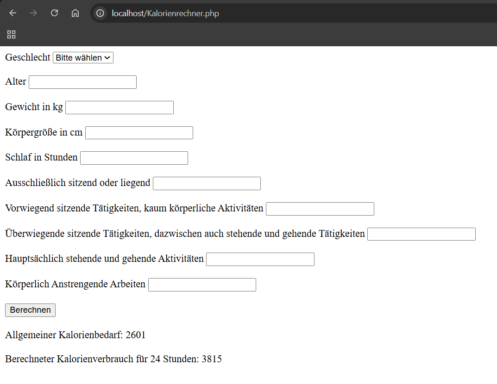
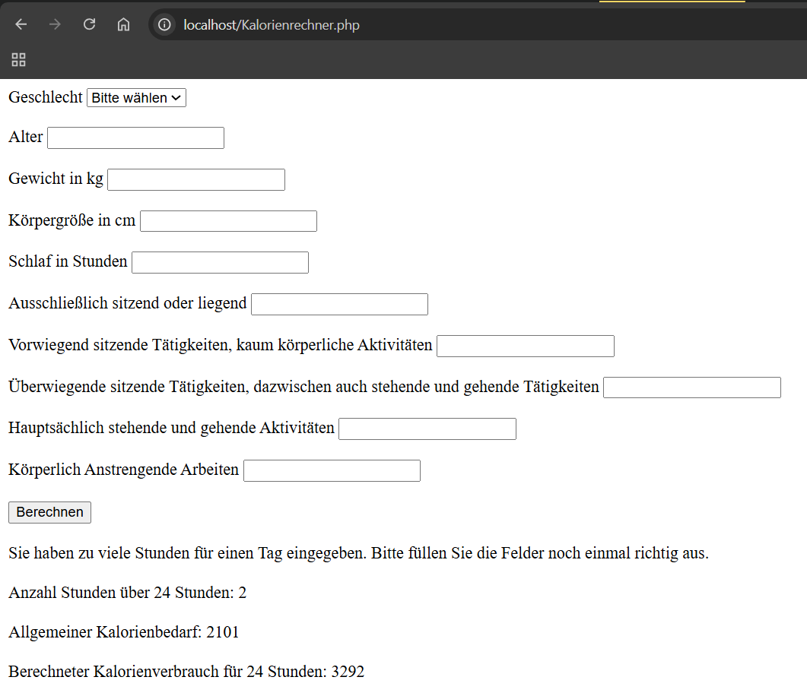

# Kalorienrechner
 

## Informationen zum Bericht:
- **Schuljahr:** 2024/25
- **Name:** Leo Mtetwa
- **Lehrgang:** LG2
- **Klasse:** 3a APC
- **Übungstag:** 27.11.2024
- **Gruppe:** B


### Programmiersprache:
*PHP*

## Aufgabe
Erstelle mit PHP eine Applikation, die folgende Werte einliest:
1.	Geschlecht, Alter, Gewicht und Größe
2.	tägliche Bewegung 
a)	Danach soll ein Kalorienbedarf berechnet werden:
Frauen: 655,1 + (9,6 x Körpergewicht in kg) + (1,8 x Körpergröße in cm) – (4,7 x Alter in Jahren)
Männer: 66,47 + (13,7 x Körpergewicht in kg) + (5 x Körpergröße in cm) – (6,8 x Alter in Jahren)
b)	dieser wird über den sogenannte PAL Faktor auf den Tag angepasst (in nachfolgender Tab)

Der Benutzer soll dabei angeben wieviel Zeit er auf die jeweilige Tätigkeit verwendet (in Stunden). Ein Formular mit allen Werten (ausser schlafen) wird angezeigt und überall kann eine Zeit eingegeben werden. Danach wird ein durchschnittlicher PAL Faktor berechnet und damit der oben berechnete Kalorienbedarf multipliziert.
Bsp: 4 h sitzend, 6 h Büro, 2 h stehend/gehend = 12 h Gesamt dh. 12 h Schlaf bleiben übrig. Berechnung: 4*1,2 + 6*1,45+2*1,85+12*0,95 / 24 = 1,19 (Durchschnitt)

Das Ergebnis wird als täglicher Kalorienbedarf welche notwendig ist, um sein Gewicht zu halten, angegeben.
Um abzunehmen sollten ca. 400 Kalorien weniger konsumiert werden. Beim Zunehmen entsprechend deutlich mehr.


### Code Blöcke:
Dropdown für Geschlecht
```PHP
<label for="Geschlecht">Geschlecht</label>
    <select id="Geschlecht" name="Geschlecht" required>
        <option value="">Bitte wählen</option>
        <option value="M">M</option>
        <option value="W">W</option>
    </select>     
```

Einlesen der Werte
```PHP
$alter = $_POST['Alter'];
$gewicht = $_POST['Gewicht'];
$geschlecht = $_POST['Geschlecht'];
$größe = $_POST['Körpergröße'];
$schlaf = $_POST['Schlaf'];
$sitzendLiegend = $_POST['Sitzend'];
$sitzendAktivität = $_POST['SitzendA'];
$stehendSitzen = $_POST['StehendS'];
$stehend = $_POST['Stehend'];
$körperlich = $_POST['Körper'];
```

Fallbehandlung, wenn zu viele oder zu wenige Stunden eingetragen worden sind.
```PHP
$Day = 24 - $schlaf - $sitzendLiegend - $sitzendAktivität - $stehendSitzen - $stehend - $körperlich;
if($Day > 0) {
    $schlaf = $schlaf + $Day;
}elseif ($Day < 0) {
    $Day = abs($Day);
    echo "Sie haben zu viele Stunden für einen Tag eingegeben. Bitte füllen Sie die Felder noch einmal richtig aus. <br><br>";
    echo "Anzahl Stunden über 24 Stunden: $Day <br><br>";
}
```

Berechnung der Kalorienwerte je nach Geschlecht.
```PHP
if($geschlecht == "M") {
    $kalv = 66.47 + (13.7 * $gewicht) + (5 * $größe) - (6.8 * $alter);
    $kalv = round($kalv);
    echo "Allgemeiner Kalorienbedarf: $kalv<br><br>";
    $pal = ($schlaf * 1.2 + $sitzendLiegend * 1.2 + $sitzendAktivität * 1.4 + $stehendSitzen * 1.6 + $stehend * 1.8 + $körperlich * 2.1) / 24;
    $kalPAL = round($kalPAL = $kalv * $pal);
    echo "Berechneter Kalorienverbrauch für 24 Stunden: $kalPAL" ;
}else {
    $kalv = 655.1 + (9.6 * $gewicht) + (1.8 * $größe) - (4.7 * $alter);
    $kalv = round($kalv);
    echo "Allgemeiner Kalorienbedarf: $kalv<br><br>";
    $pal = ($schlaf * 1.2 + $sitzendLiegend * 1.2 + $sitzendAktivität * 1.4 + $stehendSitzen * 1.6 + $stehend * 1.8 + $körperlich * 2.1) / 24;
    $kalPAL = round($kalPAL = $kalv * $pal);
    echo "Berechneter Kalorienverbrauch für 24 Stunden: $kalPAL";
}
```

### Bilder von Resultaten:
Normale Eingabe:


Fehlerhafte Eingabe, wenn zu viele Stunden eingegeben worden sind


### Fazit:
*War cool die Erfahrung mit mehr Berechnungen zu machen.*
